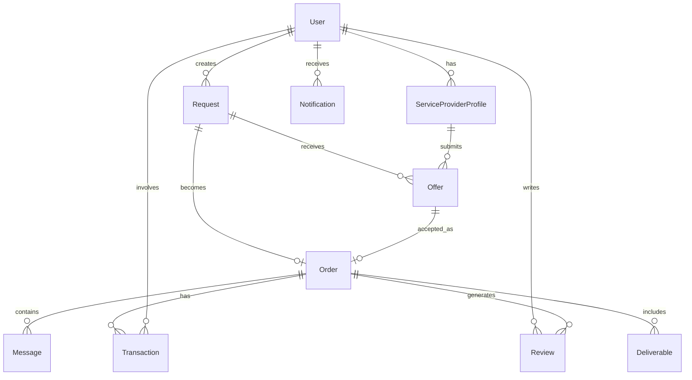

# وثيقة المتطلبات التقنية الشاملة - تطبيق "وسّط" (Wassit)
**الإصدار: 2.0 النهائي**  
**التاريخ: 24/05/2025**  
**النوع: وثيقة المتطلبات الوظيفية والتقنية (FRD/TRD)**

---

## جدول المحتويات
1. [نظرة عامة على المشروع](#1-نظرة-عامة-على-المشروع)
2. [الهيكل المعماري](#2-الهيكل-المعماري)
3. [متطلبات المستخدمين والصلاحيات](#3-متطلبات-المستخدمين-والصلاحيات)
4. [المتطلبات الوظيفية التفصيلية](#4-المتطلبات-الوظيفية-التفصيلية)
5. [قاعدة البيانات والنماذج](#5-قاعدة-البيانات-والنماذج)
6. [واجهات برمجة التطبيقات (APIs)](#6-واجهات-برمجة-التطبيقات-apis)
7. [واجهات المستخدم (UI/UX)](#7-واجهات-المستخدم-uiux)
8. [الأمان والحماية](#8-الأمان-والحماية)
9. [متطلبات الأداء](#9-متطلبات-الأداء)
10. [خطة التطوير والتنفيذ](#10-خطة-التطوير-والتنفيذ)

---

## 1. نظرة عامة على المشروع

### 1.1 تعريف المشروع
**اسم المشروع:** وسّط (Wassit)  
**النوع:** منصة وساطة رقمية B2B2C  
**النموذج التجاري:** Marketplace with Intermediary Control  
**السوق المستهدف:** العراق (بغداد كنقطة انطلاق)

### 1.2 الأهداف الأساسية
- إنشاء منصة وساطة محكمة تمنع التواصل المباشر بين الأطراف
- تحقيق هامش ربح 25-40% على كل صفقة
- الوصول إلى 1000 مستخدم نشط خلال 3 أشهر
- معالجة 500 طلب شهرياً بعد 6 أشهر

### 1.3 المميزات التنافسية
- **التحكم الكامل:** الوسيط يتحكم بكل جوانب الصفقة
- **التسعير الديناميكي:** نظام ذكي لتحديد الأسعار وهوامش الربح
- **الأمان المطلق:** منع التواصل المباشر وحماية هوية الأطراف
- **ضمان الجودة:** الوسيط يضمن جودة الخدمة والدفع

---

## 2. الهيكل المعماري

### 2.1 البنية التقنية
```
┌─────────────────────────────────────────────────────────┐
│                    تطبيقات العملاء                      │
├─────────────────────┬───────────────────────────────────┤
│   iOS App (Flutter) │   Android App (Flutter)          │
└─────────────────────┴───────────────────────────────────┘
                              │
                              ▼
┌─────────────────────────────────────────────────────────┐
│                  API Gateway (Firebase)                  │
└─────────────────────────────────────────────────────────┘
                              │
        ┌─────────────────────┴─────────────────────┐
        │                                           │
        ▼                                           ▼
┌──────────────────┐                      ┌──────────────────┐
│ Cloud Functions  │                      │    Firestore     │
│  (Business Logic)│                      │   (Database)     │
└──────────────────┘                      └──────────────────┘
        │                                           │
        └─────────────────────┬─────────────────────┘
                              │
                              ▼
┌─────────────────────────────────────────────────────────┐
│              خدمات Firebase الأخرى                      │
├─────────────────────────────────────────────────────────┤
│ • Authentication  • Cloud Storage  • Cloud Messaging    │
│ • Analytics      • Crashlytics    • Remote Config      │
└─────────────────────────────────────────────────────────┘
```

### 2.2 التقنيات المستخدمة

#### Frontend (Mobile Apps)
- **Framework:** Flutter 3.19+
- **Language:** Dart 3.3+
- **State Management:** Riverpod 2.0
- **HTTP Client:** Dio 5.0
- **Local Storage:** Hive 2.1
- **Notifications:** Firebase Cloud Messaging

#### Backend (Firebase)
- **Database:** Cloud Firestore
- **Authentication:** Firebase Auth
- **Functions:** Node.js 18 + TypeScript
- **Storage:** Cloud Storage for Firebase
- **Hosting:** Firebase Hosting (للوحة الإدارة)

#### أدوات التطوير
- **Version Control:** Git/GitHub
- **CI/CD:** GitHub Actions + Fastlane
- **Testing:** Flutter Test + Mockito
- **Monitoring:** Firebase Crashlytics + Analytics

---

## 3. متطلبات المستخدمين والصلاحيات

### 3.1 أنواع المستخدمين

#### العميل (Client)
```dart
class ClientUser {
  String id;
  String name;
  String phone;
  String city;
  double rating;
  int totalRequests;
  bool isVerified;
  DateTime createdAt;
  
  // Permissions
  bool canCreateRequest = true;
  bool canViewProviderDetails = false;
  bool canContactProviderDirectly = false;
  bool canSeeOriginalPrices = false;
}
```

#### مقدم الخدمة (Service Provider)
```dart
class ServiceProvider {
  String id;
  String businessName;
  String ownerName;
  String phone;
  String city;
  List<ServiceType> services;
  double rating;
  int completedJobs;
  Map<String, String> portfolio; // نماذج الأعمال
  bool isApproved;
  DateTime approvedAt;
  
  // Permissions
  bool canViewClientDetails = false;
  bool canContactClientDirectly = false;
  bool canSeeFinalPrices = false;
  bool canCreateDirectOffers = false;
}
```

#### المشرف/الوسيط (Admin)
```dart
class AdminUser {
  String id;
  String name;
  String phone;
  AdminRole role; // SUPER_ADMIN, MODERATOR
  List<Permission> permissions;
  
  // Full permissions
  bool hasFullAccess = true;
}
```

### 3.2 مصفوفة الصلاحيات

| الوظيفة | العميل | مقدم الخدمة | المشرف |
|---------|--------|-------------|---------|
| إنشاء طلبات | ✓ | ✗ | ✓ |
| عرض تفاصيل الطلبات | محدود | محدود | كامل |
| تقديم عروض | ✗ | ✓ | ✓ |
| تحديد الأسعار النهائية | ✗ | ✗ | ✓ |
| التواصل المباشر | ✗ | ✗ | ✓ |
| عرض البيانات الشخصية | ✗ | ✗ | ✓ |
| إدارة المدفوعات | ✗ | ✗ | ✓ |
| عرض التقارير | محدود | محدود | كامل |

---

## 4. المتطلبات الوظيفية التفصيلية

### 4.1 دورة حياة الطلب (Request Lifecycle)

```
[عميل] إنشاء طلب جديد
         │
         ▼
[نظام] الطلب في حالة "PENDING_REVIEW"
         │
         ▼
[مشرف] مراجعة وتصنيف الطلب
         │
         ▼
[نظام] إشعار مقدمي الخدمة المناسبين
         │
         ▼
[مقدمو الخدمة] تقديم العروض
         │
         ▼
[مشرف] مراجعة العروض وإضافة هامش الربح
         │
         ▼
[عميل] استلام العرض النهائي
         │
    ┌────┴────┐
    │         │
[قبول]    [رفض]
    │         │
    ▼         ▼
[دفع]    [إلغاء]
    │
    ▼
[تنفيذ]
    │
    ▼
[تسليم]
    │
    ▼
[تقييم]
```

### 4.2 نظام التسعير الديناميكي

#### خوارزمية حساب السعر النهائي
```typescript
interface PricingRule {
  serviceType: ServiceType;
  baseMargin: number; // نسبة مئوية
  volumeDiscount: VolumeDiscount[];
  clientTypeMultiplier: Map<ClientType, number>;
  urgencyMultiplier: Map<Urgency, number>;
  seasonalAdjustment: SeasonalRule[];
}

function calculateFinalPrice(
  originalPrice: number,
  request: Request,
  client: Client,
  pricingRules: PricingRule[]
): FinalPrice {
  const rule = pricingRules.find(r => r.serviceType === request.serviceType);
  
  let margin = rule.baseMargin;
  
  // تطبيق الخصومات والمضاعفات
  margin *= rule.clientTypeMultiplier.get(client.type) || 1;
  margin *= rule.urgencyMultiplier.get(request.urgency) || 1;
  margin += getSeasonalAdjustment(rule.seasonalAdjustment);
  
  // تطبيق خصم الكمية
  const volumeDiscount = calculateVolumeDiscount(client.orderHistory);
  margin -= volumeDiscount;
  
  // الحد الأدنى والأقصى للهامش
  margin = Math.max(MIN_MARGIN, Math.min(MAX_MARGIN, margin));
  
  return {
    originalPrice,
    margin,
    finalPrice: originalPrice * (1 + margin / 100),
    breakdown: { /* تفاصيل الحساب */ }
  };
}
```

### 4.3 نظام الحزم والباقات

```typescript
interface ServiceBundle {
  id: string;
  name: string;
  services: ServiceComponent[];
  discountPercentage: number;
  validityDays: number;
  maxUsage: number;
}

interface ServiceComponent {
  serviceType: ServiceType;
  quantity: number;
  specifications: Map<string, any>;
}

// مثال: باقة التسويق الشاملة
const marketingBundle: ServiceBundle = {
  id: "MKT_FULL_001",
  name: "باقة التسويق الشاملة",
  services: [
    { serviceType: "PHOTOGRAPHY", quantity: 1, specifications: { photos: 20 } },
    { serviceType: "GRAPHIC_DESIGN", quantity: 5, specifications: { designs: 5 } },
    { serviceType: "SOCIAL_MEDIA", quantity: 30, specifications: { days: 30 } }
  ],
  discountPercentage: 15,
  validityDays: 45,
  maxUsage: 1
};
```

### 4.4 نظام منع التواصل المباشر

```typescript
class CommunicationFilter {
  private patterns: RegExp[] = [
    /\d{10,14}/g, // أرقام الهواتف
    /[\w\.-]+@[\w\.-]+\.\w+/g, // الإيميلات
    /(facebook|instagram|telegram|whatsapp)\.com/gi, // وسائل التواصل
    /07[3-9]\d{8}/g // أرقام عراقية
  ];
  
  filterMessage(message: string): FilterResult {
    let filtered = message;
    let violations: Violation[] = [];
    
    for (const pattern of this.patterns) {
      const matches = message.match(pattern);
      if (matches) {
        violations.push({ pattern: pattern.source, matches });
        filtered = filtered.replace(pattern, '[محذوف]');
      }
    }
    
    return {
      originalMessage: message,
      filteredMessage: filtered,
      hasViolations: violations.length > 0,
      violations
    };
  }
  
  async handleViolation(userId: string, violation: Violation): Promise<void> {
    // تسجيل المخالفة
    await logViolation(userId, violation);
    
    // إرسال تحذير
    await sendWarning(userId);
    
    // تعليق الحساب بعد 3 مخالفات
    const count = await getViolationCount(userId);
    if (count >= 3) {
      await suspendAccount(userId);
    }
  }
}
```

### 4.5 نظام العروض المتعددة

```typescript
interface MultiOfferStrategy {
  generateOffers(originalOffer: Offer): Offer[] {
    return [
      {
        tier: "BASIC",
        price: originalOffer.price * 1.2,
        deliveryDays: originalOffer.deliveryDays,
        features: originalOffer.features.slice(0, -2)
      },
      {
        tier: "STANDARD",
        price: originalOffer.price * 1.35,
        deliveryDays: originalOffer.deliveryDays - 1,
        features: originalOffer.features
      },
      {
        tier: "PREMIUM",
        price: originalOffer.price * 1.6,
        deliveryDays: Math.max(1, originalOffer.deliveryDays - 2),
        features: [...originalOffer.features, "أولوية في التنفيذ", "مراجعة إضافية"]
      }
    ];
  }
}
```

---

## 5. قاعدة البيانات والنماذج

### 5.1 مخطط قاعدة البيانات

```typescript
// Users Collection
interface User {
  id: string;
  phone: string;
  phoneVerified: boolean;
  name: string;
  type: 'CLIENT' | 'PROVIDER' | 'ADMIN';
  city: string;
  cityDistrict?: string; // الحي/المنطقة
  rating: number;
  ratingCount: number;
  status: 'ACTIVE' | 'SUSPENDED' | 'PENDING_APPROVAL';
  metadata: {
    lastLogin: Timestamp;
    loginCount: number;
    deviceTokens: string[]; // للإشعارات
    preferredLanguage: 'ar' | 'en';
  };
  createdAt: Timestamp;
  updatedAt: Timestamp;
}

// Service Providers Additional Info
interface ServiceProviderProfile {
  userId: string;
  businessName: string;
  businessType: 'INDIVIDUAL' | 'COMPANY' | 'FREELANCER';
  services: ServiceType[];
  portfolio: {
    images: string[];
    description: string;
    uploadedAt: Timestamp;
  }[];
  bankAccount?: { // للمرحلة المستقبلية
    bankName: string;
    accountNumber: string;
    accountHolder: string;
  };
  documents: {
    type: 'ID' | 'BUSINESS_LICENSE' | 'PORTFOLIO';
    url: string;
    status: 'PENDING' | 'APPROVED' | 'REJECTED';
    reviewNote?: string;
  }[];
  workingHours: {
    [key: string]: { start: string; end: string; }
  };
  responseTime: number; // متوسط وقت الاستجابة بالساعات
  completionRate: number; // نسبة إكمال المشاريع
  earnings: {
    total: number;
    pending: number;
    withdrawn: number;
  };
}

// Requests Collection
interface Request {
  id: string;
  clientId: string;
  serviceType: ServiceType;
  title: string;
  description: string;
  requirements: {
    [key: string]: any; // متطلبات ديناميكية حسب نوع الخدمة
  };
  attachments: {
    type: 'IMAGE' | 'DOCUMENT' | 'AUDIO' | 'VIDEO';
    url: string;
    name: string;
    size: number;
  }[];
  location: {
    city: string;
    district?: string;
    coordinates?: GeoPoint; // للخدمات التي تتطلب موقع
  };
  budget?: {
    min: number;
    max: number;
    isFlexible: boolean;
  };
  deadline?: Timestamp;
  urgency: 'NORMAL' | 'URGENT' | 'VERY_URGENT';
  status: RequestStatus;
  visibility: 'PUBLIC' | 'SELECTED_PROVIDERS' | 'HIDDEN';
  targetProviders?: string[]; // معرفات مقدمي الخدمة المستهدفين
  metadata: {
    viewCount: number;
    offerCount: number;
    avgResponseTime: number;
  };
  timeline: {
    created: Timestamp;
    published?: Timestamp;
    firstOffer?: Timestamp;
    accepted?: Timestamp;
    started?: Timestamp;
    completed?: Timestamp;
    cancelled?: Timestamp;
  };
  createdAt: Timestamp;
  updatedAt: Timestamp;
}

// Offers Collection
interface Offer {
  id: string;
  requestId: string;
  providerId: string;
  // أسعار مخفية عن العميل
  cost: {
    original: number; // السعر الأصلي من مقدم الخدمة
    margin: number; // الهامش المضاف
    final: number; // السعر النهائي للعميل
    breakdown?: { // تفاصيل التكلفة
      labor: number;
      materials: number;
      overhead: number;
    };
  };
  deliveryTime: {
    days: number;
    type: 'BUSINESS_DAYS' | 'CALENDAR_DAYS';
    rushAvailable: boolean;
    rushCost?: number;
  };
  proposal: {
    approach: string; // كيف سيتم تنفيذ العمل
    deliverables: string[]; // ما سيحصل عليه العميل
    terms: string[]; // الشروط والأحكام
    portfolio?: string[]; // نماذج أعمال سابقة ذات صلة
  };
  variations?: { // عروض متعددة
    tier: 'BASIC' | 'STANDARD' | 'PREMIUM';
    price: number;
    features: string[];
    deliveryDays: number;
  }[];
  status: 'DRAFT' | 'SUBMITTED' | 'UNDER_REVIEW' | 'SENT_TO_CLIENT' | 'ACCEPTED' | 'REJECTED' | 'EXPIRED';
  adminNotes?: string; // ملاحظات المشرف
  rejectionReason?: string;
  expiresAt: Timestamp;
  timeline: {
    created: Timestamp;
    submitted?: Timestamp;
    reviewed?: Timestamp;
    sentToClient?: Timestamp;
    decided?: Timestamp;
  };
  createdAt: Timestamp;
  updatedAt: Timestamp;
}

// Orders Collection (الطلبات المقبولة)
interface Order {
  id: string;
  requestId: string;
  offerId: string;
  clientId: string;
  providerId: string;
  amount: {
    total: number;
    paid: number;
    providerShare: number; // حصة مقدم الخدمة
    platformFee: number; // عمولة المنصة
  };
  status: OrderStatus;
  paymentStatus: 'PENDING' | 'PAID' | 'RELEASED' | 'REFUNDED';
  deliverables: {
    id: string;
    type: string;
    url?: string;
    description: string;
    uploadedAt?: Timestamp;
    status: 'PENDING' | 'DELIVERED' | 'APPROVED' | 'REJECTED';
  }[];
  communication: {
    messageCount: number;
    lastMessageAt?: Timestamp;
    averageResponseTime: number;
  };
  timeline: {
    accepted: Timestamp;
    paid?: Timestamp;
    started?: Timestamp;
    delivered?: Timestamp;
    completed?: Timestamp;
    disputed?: Timestamp;
    resolved?: Timestamp;
  };
  dispute?: {
    reason: string;
    raisedBy: 'CLIENT' | 'PROVIDER';
    status: 'OPEN' | 'UNDER_REVIEW' | 'RESOLVED';
    resolution?: string;
    raisedAt: Timestamp;
    resolvedAt?: Timestamp;
  };
  createdAt: Timestamp;
  updatedAt: Timestamp;
}

// Messages Collection
interface Message {
  id: string;
  orderId: string;
  senderId: string;
  senderType: 'CLIENT' | 'PROVIDER' | 'ADMIN';
  recipientId: string;
  recipientType: 'CLIENT' | 'PROVIDER' | 'ADMIN';
  content: {
    text?: string;
    filteredText?: string; // النص بعد الفلترة
    hasViolations: boolean;
    attachments?: {
      type: string;
      url: string;
      name: string;
    }[];
  };
  metadata: {
    isRead: boolean;
    readAt?: Timestamp;
    isEdited: boolean;
    editedAt?: Timestamp;
    originalContent?: string; // في حالة التعديل
  };
  adminReview?: {
    reviewed: boolean;
    reviewedBy?: string;
    reviewedAt?: Timestamp;
    action?: 'APPROVED' | 'BLOCKED' | 'EDITED';
  };
  createdAt: Timestamp;
}

// Transactions Collection
interface Transaction {
  id: string;
  orderId: string;
  type: 'PAYMENT' | 'REFUND' | 'WITHDRAWAL' | 'FEE';
  amount: number;
  currency: 'IQD';
  status: 'PENDING' | 'PROCESSING' | 'COMPLETED' | 'FAILED' | 'CANCELLED';
  method: 'CASH' | 'ZAIN_CASH' | 'ASIA_HAWALA' | 'BANK_TRANSFER';
  parties: {
    from: {
      id: string;
      type: 'CLIENT' | 'PROVIDER' | 'PLATFORM';
      name: string;
    };
    to: {
      id: string;
      type: 'CLIENT' | 'PROVIDER' | 'PLATFORM';
      name: string;
    };
  };
  metadata: {
    referenceNumber?: string;
    bankDetails?: any;
    failureReason?: string;
    processedBy?: string; // معرف المشرف
  };
  timeline: {
    initiated: Timestamp;
    processed?: Timestamp;
    completed?: Timestamp;
    failed?: Timestamp;
  };
  createdAt: Timestamp;
  updatedAt: Timestamp;
}

// Reviews Collection
interface Review {
  id: string;
  orderId: string;
  reviewerId: string;
  reviewerType: 'CLIENT' | 'PROVIDER';
  reviewedId: string;
  reviewedType: 'CLIENT' | 'PROVIDER';
  rating: {
    overall: number; // 1-5
    communication?: number;
    quality?: number;
    timeliness?: number;
    value?: number;
  };
  comment: string;
  isAnonymous: boolean;
  adminReview: {
    isApproved: boolean;
    approvedBy?: string;
    approvedAt?: Timestamp;
    isHidden: boolean;
    hiddenReason?: string;
  };
  response?: {
    text: string;
    respondedAt: Timestamp;
  };
  helpful: {
    count: number;
    users: string[];
  };
  createdAt: Timestamp;
  updatedAt: Timestamp;
}

// Notifications Collection
interface Notification {
  id: string;
  userId: string;
  type: NotificationType;
  title: string;
  body: string;
  data: { [key: string]: any };
  priority: 'LOW' | 'NORMAL' | 'HIGH';
  channels: ('PUSH' | 'IN_APP' | 'SMS' | 'EMAIL')[];
  status: {
    push?: 'SENT' | 'DELIVERED' | 'FAILED';
    inApp?: 'UNREAD' | 'READ';
    sms?: 'SENT' | 'DELIVERED' | 'FAILED';
    email?: 'SENT' | 'DELIVERED' | 'FAILED';
  };
  readAt?: Timestamp;
  expiresAt?: Timestamp;
  createdAt: Timestamp;
}

// System Settings Collection
interface SystemSettings {
  id: 'GLOBAL';
  pricing: {
    defaultMargins: Map<ServiceType, number>;
    minMargin: number;
    maxMargin: number;
    urgencyMultipliers: {
      NORMAL: number;
      URGENT: number;
      VERY_URGENT: number;
    };
  };
  operational: {
    autoApproveProviders: boolean;
    requireAdminApprovalForOffers: boolean;
    maxOffersPerRequest: number;
    requestExpiryDays: number;
    offerExpiryHours: number;
  };
  communication: {
    blockedPatterns: string[];
    warningThreshold: number;
    suspensionThreshold: number;
  };
  payment: {
    escrowEnabled: boolean;
    releasePeriodDays: number;
    refundPeriodDays: number;
  };
  features: {
    bundlesEnabled: boolean;
    multiOfferEnabled: boolean;
    dynamicPricingEnabled: boolean;
  };
  updatedAt: Timestamp;
  updatedBy: string;
}
```

### 5.2 العلاقات بين الجداول



---

## 6. واجهات برمجة التطبيقات (APIs)

### 6.1 هيكل API العام

```typescript
// Base URL: https://api.wassit.app/v1

interface ApiResponse<T> {
  success: boolean;
  data?: T;
  error?: {
    code: string;
    message: string;
    details?: any;
  };
  pagination?: {
    total: number;
    page: number;
    pageSize: number;
    hasNext: boolean;
  };
}
```

### 6.2 نقاط النهاية الرئيسية

#### Authentication APIs
```typescript
// تسجيل الدخول - المرحلة الأولى
POST /auth/login/initiate
Body: {
  phone: string; // +9647XXXXXXXXX
}
Response: {
  sessionId: string;
  expiresIn: number; // seconds
}

// تأكيد OTP
POST /auth/login/verify
Body: {
  sessionId: string;
  otp: string;
}
Response: {
  token: string;
  refreshToken: string;
  user: User;
  isNewUser: boolean;
}

// تحديث التوكن
POST /auth/refresh
Headers: {
  Authorization: "Bearer {refreshToken}"
}
Response: {
  token: string;
  refreshToken: string;
}

// تسجيل الخروج
POST /auth/logout
Headers: {
  Authorization: "Bearer {token}"
}
```

#### User APIs
```typescript
// الملف الشخصي
GET /users/profile
Headers: {
  Authorization: "Bearer {token}"
}

// تحديث الملف الشخصي
PATCH /users/profile
Headers: {
  Authorization: "Bearer {token}"
}
Body: {
  name?: string;
  city?: string;
  businessName?: string; // لمقدمي الخدمة
}

// التسجيل كمقدم خدمة
POST /users/register-as-provider
Headers: {
  Authorization: "Bearer {token}"
}
Body: {
  businessName: string;
  businessType: 'INDIVIDUAL' | 'COMPANY' | 'FREELANCER';
  services: ServiceType[];
  documents: File[]; // multipart
}
```

#### Request APIs
```typescript
// إنشاء طلب جديد
POST /requests
Headers: {
  Authorization: "Bearer {token}"
}
Body: {
  serviceType: ServiceType;
  title: string;
  description: string;
  requirements: object;
  attachments?: File[];
  location: {
    city: string;
    district?: string;
  };
  urgency: 'NORMAL' | 'URGENT' | 'VERY_URGENT';
  deadline?: string; // ISO date
}

// قائمة طلباتي (للعملاء)
GET /requests/my-requests
Headers: {
  Authorization: "Bearer {token}"
}
Query: {
  status?: RequestStatus;
  page?: number;
  pageSize?: number;
}

// الطلبات المتاحة (لمقدمي الخدمة)
GET /requests/available
Headers: {
  Authorization: "Bearer {token}"
}
Query: {
  serviceType?: ServiceType;
  city?: string;
  urgency?: string;
}

// تفاصيل طلب
GET /requests/{requestId}
Headers: {
  Authorization: "Bearer {token}"
}
```

#### Offer APIs
```typescript
// تقديم عرض (لمقدمي الخدمة)
POST /offers
Headers: {
  Authorization: "Bearer {token}"
}
Body: {
  requestId: string;
  price: number;
  deliveryDays: number;
  proposal: {
    approach: string;
    deliverables: string[];
  };
  portfolioItems?: string[]; // معرفات أعمال سابقة
}

// العروض المستلمة (للعملاء)
GET /requests/{requestId}/offers
Headers: {
  Authorization: "Bearer {token}"
}

// قبول عرض
POST /offers/{offerId}/accept
Headers: {
  Authorization: "Bearer {token}"
}

// رفض عرض
POST /offers/{offerId}/reject
Headers: {
  Authorization: "Bearer {token}"
}
Body: {
  reason?: string;
}
```

#### Order APIs
```typescript
// تفاصيل الطلبية
GET /orders/{orderId}
Headers: {
  Authorization: "Bearer {token}"
}

// رفع المخرجات (لمقدمي الخدمة)
POST /orders/{orderId}/deliverables
Headers: {
  Authorization: "Bearer {token}"
}
Body: {
  type: string;
  description: string;
  files?: File[];
}

// تأكيد الاستلام (للعملاء)
POST /orders/{orderId}/confirm-delivery
Headers: {
  Authorization: "Bearer {token}"
}

// فتح نزاع
POST /orders/{orderId}/dispute
Headers: {
  Authorization: "Bearer {token}"
}
Body: {
  reason: string;
  details: string;
}
```

#### Message APIs
```typescript
// إرسال رسالة
POST /messages
Headers: {
  Authorization: "Bearer {token}"
}
Body: {
  orderId: string;
  text: string;
  attachments?: File[];
}

// جلب المحادثة
GET /orders/{orderId}/messages
Headers: {
  Authorization: "Bearer {token}"
}
Query: {
  page?: number;
  pageSize?: number;
}

// وضع علامة مقروء
PATCH /messages/{messageId}/read
Headers: {
  Authorization: "Bearer {token}"
}
```

#### Admin APIs
```typescript
// لوحة القيادة
GET /admin/dashboard
Headers: {
  Authorization: "Bearer {adminToken}"
}

// إدارة المستخدمين
GET /admin/users
PATCH /admin/users/{userId}
POST /admin/users/{userId}/suspend
POST /admin/users/{userId}/activate

// إدارة الطلبات
GET /admin/requests
PATCH /admin/requests/{requestId}
POST /admin/requests/{requestId}/assign-providers

// إدارة العروض
GET /admin/offers
PATCH /admin/offers/{offerId}
POST /admin/offers/{offerId}/set-final-price
Body: {
  finalPrice: number;
  marginPercentage: number;
  notes?: string;
}

// التقارير
GET /admin/reports/revenue
GET /admin/reports/users
GET /admin/reports/services
Query: {
  startDate: string;
  endDate: string;
  groupBy?: 'day' | 'week' | 'month';
}
```

### 6.3 معالجة الأخطاء

```typescript
enum ErrorCode {
  // Authentication Errors (1xxx)
  INVALID_CREDENTIALS = 'E1001',
  TOKEN_EXPIRED = 'E1002',
  UNAUTHORIZED = 'E1003',
  
  // Validation Errors (2xxx)
  INVALID_INPUT = 'E2001',
  MISSING_REQUIRED_FIELD = 'E2002',
  
  // Business Logic Errors (3xxx)
  REQUEST_NOT_FOUND = 'E3001',
  OFFER_ALREADY_EXISTS = 'E3002',
  INSUFFICIENT_BALANCE = 'E3003',
  
  // System Errors (5xxx)
  INTERNAL_ERROR = 'E5001',
  SERVICE_UNAVAILABLE = 'E5002'
}

// مثال على رد خطأ
{
  "success": false,
  "error": {
    "code": "E2001",
    "message": "البيانات المدخلة غير صحيحة",
    "details": {
      "phone": "رقم الهاتف يجب أن يبدأ بـ 07"
    }
  }
}
```

---

## 7. واجهات المستخدم (UI/UX)

### 7.1 مبادئ التصميم

- **البساطة:** واجهات بسيطة وسهلة الاستخدام
- **اللغة العربية أولاً:** كل النصوص بالعربية العراقية
- **التوافقية:** تصميم متجاوب يعمل على كل الأجهزة
- **الألوان:** استخدام ألوان تعكس الهوية العراقية

### 7.2 الشاشات الرئيسية

#### شاشة البداية (Splash Screen)
```dart
class SplashScreen extends StatelessWidget {
  @override
  Widget build(BuildContext context) {
    return Scaffold(
      backgroundColor: AppColors.primary,
      body: Center(
        child: Column(
          mainAxisAlignment: MainAxisAlignment.center,
          children: [
            Logo(size: 120),
            SizedBox(height: 20),
            Text(
              'وسّط',
              style: TextStyle(
                fontSize: 32,
                fontWeight: FontWeight.bold,
                color: Colors.white,
              ),
            ),
            Text(
              'منصة الخدمات الموثوقة',
              style: TextStyle(
                fontSize: 16,
                color: Colors.white70,
              ),
            ),
          ],
        ),
      ),
    );
  }
}
```

#### شاشة تسجيل الدخول
- إدخال رقم الهاتف
- اختيار نوع الحساب (عميل/مقدم خدمة)
- شاشة إدخال OTP
- رسائل خطأ واضحة

#### الشاشة الرئيسية للعميل
```
┌─────────────────────────────┐
│     وسّط                   ⚡│
├─────────────────────────────┤
│                             │
│  ┌───────┐    ┌───────┐    │
│  │       │    │       │    │
│  │  📷   │    │  🎨   │    │
│  │تصوير  │    │تصميم │    │
│  └───────┘    └───────┘    │
│                             │
│  ┌───────┐    ┌───────┐    │
│  │       │    │       │    │
│  │  ✍️   │    │  📱   │    │
│  │ كتابة │    │سوشيال│    │
│  └───────┘    └───────┘    │
│                             │
│  ╔═══════════════════════╗  │
│  ║   طلباتي الحالية     ║  │
│  ╚═══════════════════════╝  │
│                             │
│  ┌─────────────────────┐    │
│  │ تصوير منتجات       │    │
│  │ قيد التنفيذ ⏳     │    │
│  └─────────────────────┘    │
│                             │
├─────────────────────────────┤
│  🏠        📋        👤     │
└─────────────────────────────┘
```

#### شاشة إنشاء طلب
- اختيار نوع الخدمة
- وصف تفصيلي مع إرشادات
- رفع الملفات (صور/مستندات)
- تحديد الموقع والموعد
- معاينة قبل الإرسال

#### شاشة العروض المستلمة
```
┌─────────────────────────────┐
│ العروض المستلمة (3)       ←│
├─────────────────────────────┤
│                             │
│ ┌─────────────────────────┐ │
│ │ عرض أساسي              │ │
│ │ 250,000 د.ع            │ │
│ │ التسليم: 3 أيام        │ │
│ │ ⭐⭐⭐⭐ (4.5)         │ │
│ │ [عرض التفاصيل]        │ │
│ └─────────────────────────┘ │
│                             │
│ ┌─────────────────────────┐ │
│ │ عرض متميز ⭐          │ │
│ │ 350,000 د.ع            │ │
│ │ التسليم: يومين         │ │
│ │ ⭐⭐⭐⭐⭐ (4.8)       │ │
│ │ [عرض التفاصيل]        │ │
│ └─────────────────────────┘ │
│                             │
└─────────────────────────────┘
```

### 7.3 تصميم المكونات

#### بطاقة الخدمة
```dart
class ServiceCard extends StatelessWidget {
  final Service service;
  
  @override
  Widget build(BuildContext context) {
    return Card(
      elevation: 4,
      shape: RoundedRectangleBorder(
        borderRadius: BorderRadius.circular(12),
      ),
      child: InkWell(
        onTap: () => _navigateToServiceRequest(context),
        child: Container(
          padding: EdgeInsets.all(16),
          child: Column(
            children: [
              Icon(
                service.icon,
                size: 48,
                color: AppColors.primary,
              ),
              SizedBox(height: 8),
              Text(
                service.name,
                style: TextStyle(
                  fontSize: 16,
                  fontWeight: FontWeight.bold,
                ),
              ),
            ],
          ),
        ),
      ),
    );
  }
}
```

### 7.4 نظام الإشعارات في الواجهة

```dart
class NotificationHandler {
  static void showInAppNotification(BuildContext context, Notification notification) {
    final overlay = Overlay.of(context);
    final overlayEntry = OverlayEntry(
      builder: (context) => Positioned(
        top: MediaQuery.of(context).padding.top + 10,
        left: 16,
        right: 16,
        child: Material(
          elevation: 8,
          borderRadius: BorderRadius.circular(8),
          child: Container(
            padding: EdgeInsets.all(12),
            decoration: BoxDecoration(
              color: _getColorByType(notification.type),
              borderRadius: BorderRadius.circular(8),
            ),
            child: Row(
              children: [
                Icon(
                  _getIconByType(notification.type),
                  color: Colors.white,
                ),
                SizedBox(width: 12),
                Expanded(
                  child: Column(
                    crossAxisAlignment: CrossAxisAlignment.start,
                    children: [
                      Text(
                        notification.title,
                        style: TextStyle(
                          color: Colors.white,
                          fontWeight: FontWeight.bold,
                        ),
                      ),
                      Text(
                        notification.body,
                        style: TextStyle(color: Colors.white70),
                      ),
                    ],
                  ),
                ),
              ],
            ),
          ),
        ),
      ),
    );
    
    overlay?.insert(overlayEntry);
    Future.delayed(Duration(seconds: 3), () {
      overlayEntry.remove();
    });
  }
}
```

---

## 8. الأمان والحماية

### 8.1 تشفير البيانات

```typescript
// تشفير في النقل
- HTTPS/TLS 1.3 لكل الاتصالات
- Certificate Pinning في التطبيق
- تشفير End-to-End للرسائل الحساسة

// تشفير في التخزين
- تشفير قاعدة البيانات باستخدام Firebase encryption
- تشفير الملفات في Cloud Storage
- عدم حفظ بيانات حساسة محلياً
```

### 8.2 المصادقة والتخويل

```typescript
class AuthenticationMiddleware {
  async verifyToken(token: string): Promise<DecodedToken> {
    try {
      const decoded = await admin.auth().verifyIdToken(token);
      
      // التحقق من صلاحية الحساب
      const user = await getUserById(decoded.uid);
      if (user.status === 'SUSPENDED') {
        throw new UnauthorizedError('Account suspended');
      }
      
      // التحقق من الصلاحيات
      if (!hasRequiredPermissions(user, requiredPermissions)) {
        throw new ForbiddenError('Insufficient permissions');
      }
      
      return decoded;
    } catch (error) {
      throw new UnauthorizedError('Invalid token');
    }
  }
}
```

### 8.3 حماية من الهجمات

```typescript
// Rate Limiting
const rateLimiter = {
  login: rateLimit({
    windowMs: 15 * 60 * 1000, // 15 دقيقة
    max: 5, // 5 محاولات
    message: 'Too many login attempts'
  }),
  
  api: rateLimit({
    windowMs: 1 * 60 * 1000, // دقيقة واحدة
    max: 60, // 60 طلب
    keyGenerator: (req) => req.user?.id || req.ip
  })
};

// Input Validation
const validateInput = (schema: any) => {
  return (req: Request, res: Response, next: NextFunction) => {
    const { error } = schema.validate(req.body);
    if (error) {
      return res.status(400).json({
        success: false,
        error: {
          code: 'INVALID_INPUT',
          message: error.details[0].message
        }
      });
    }
    next();
  };
};
```

### 8.4 تسجيل الأحداث والمراقبة

```typescript
interface SecurityLog {
  timestamp: Date;
  userId?: string;
  ip: string;
  userAgent: string;
  action: string;
  resource: string;
  result: 'SUCCESS' | 'FAILURE';
  details?: any;
}

class SecurityLogger {
  async logSecurityEvent(event: SecurityLog): Promise<void> {
    // حفظ في Firestore
    await db.collection('security_logs').add(event);
    
    // إرسال تنبيه للأحداث الحرجة
    if (this.isCriticalEvent(event)) {
      await this.notifyAdmins(event);
    }
  }
  
  private isCriticalEvent(event: SecurityLog): boolean {
    const criticalActions = [
      'MULTIPLE_FAILED_LOGINS',
      'UNAUTHORIZED_ACCESS_ATTEMPT',
      'DATA_BREACH_ATTEMPT',
      'SUSPICIOUS_PATTERN_DETECTED'
    ];
    return criticalActions.includes(event.action);
  }
}
```

---

## 9. متطلبات الأداء

### 9.1 معايير الأداء المستهدفة

| المعيار | القيمة المستهدفة |
|---------|------------------|
| وقت تحميل الشاشة الأولى | < 2 ثانية |
| وقت الاستجابة لـ API | < 500ms (P95) |
| معدل الأخطاء | < 0.1% |
| التوفر (Uptime) | 99.9% |
| حجم التطبيق | < 30MB |
| استهلاك البطارية | منخفض |
| استهلاك البيانات | < 5MB/ساعة استخدام |

### 9.2 استراتيجيات التحسين

```dart
// Lazy Loading للصور
class OptimizedImageLoader {
  static Widget loadImage(String url, {double? width, double? height}) {
    return CachedNetworkImage(
      imageUrl: url,
      width: width,
      height: height,
      placeholder: (context, url) => Shimmer.fromColors(
        baseColor: Colors.grey[300]!,
        highlightColor: Colors.grey[100]!,
        child: Container(
          width: width,
          height: height,
          color: Colors.white,
        ),
      ),
      errorWidget: (context, url, error) => Icon(Icons.error),
      memCacheWidth: width?.toInt(),
      memCacheHeight: height?.toInt(),
    );
  }
}

// Pagination للقوائم الطويلة
class PaginatedListView<T> extends StatefulWidget {
  final Future<List<T>> Function(int page) fetchData;
  final Widget Function(T item) itemBuilder;
  
  // Implementation with infinite scroll
}
```

### 9.3 التخزين المؤقت (Caching)

```typescript
// Server-side caching
const cacheStrategy = {
  staticData: {
    ttl: 86400, // 24 ساعة
    keys: ['cities', 'serviceTypes', 'settings']
  },
  userSpecific: {
    ttl: 3600, // ساعة واحدة
    keys: ['profile', 'notifications', 'orders']
  },
  realtime: {
    ttl: 0, // لا تخزين مؤقت
    keys: ['messages', 'offers', 'activeRequests']
  }
};

// Client-side caching
class CacheManager {
  static const Duration defaultCacheDuration = Duration(hours: 1);
  
  static Future<T?> getCached<T>(String key) async {
    final box = await Hive.openBox('cache');
    final cached = box.get(key);
    
    if (cached != null && !isExpired(cached['timestamp'])) {
      return cached['data'] as T;
    }
    return null;
  }
  
  static Future<void> cache<T>(String key, T data) async {
    final box = await Hive.openBox('cache');
    await box.put(key, {
      'data': data,
      'timestamp': DateTime.now().millisecondsSinceEpoch,
    });
  }
}
```

---

## 10. خطة التطوير والتنفيذ

### 10.1 المراحل التفصيلية

#### المرحلة 1: التأسيس (أسبوع 1-2)

**أسبوع 1: البنية التحتية**
- إعداد مشروع Firebase
- إعداد مستودع Git وبيئة CI/CD
- تصميم وإنشاء قاعدة البيانات
- إعداد Cloud Functions الأساسية
- كتابة وثائق API

**أسبوع 2: التصميم والنماذج**
- تصميم UI/UX كامل في Figma
- إنشاء Design System
- تطوير النماذج الأولية
- مراجعة واعتماد التصاميم

#### المرحلة 2: التطوير الأساسي (أسبوع 3-6)

**أسبوع 3: نظام المستخدمين**
- تطوير نظام التسجيل والمصادقة
- واجهات تسجيل الدخول و OTP
- إدارة الملفات الشخصية
- نظام الصلاحيات

**أسبوع 4: نظام الطلبات**
- واجهات إنشاء الطلبات
- عرض وإدارة الطلبات
- نظام الفلترة والبحث
- رفع الملفات والمرفقات

**أسبوع 5: نظام العروض**
- تقديم العروض من مقدمي الخدمة
- نظام التسعير الديناميكي
- عرض العروض للعملاء
- قبول ورفض العروض

**أسبوع 6: نظام الطلبيات**
- إدارة الطلبيات النشطة
- نظام الرسائل والتواصل
- رفع المخرجات
- تأكيد الاستلام

#### المرحلة 3: الميزات المتقدمة (أسبوع 7-8)

**أسبوع 7: لوحة تحكم الإدارة**
- واجهة ويب للإدارة
- إدارة المستخدمين والطلبات
- نظام التقارير
- إدارة الإعدادات

**أسبوع 8: الميزات الإضافية**
- نظام التقييمات
- نظام الإشعارات
- الدفع الوهمي
- نظام الحزم والباقات

#### المرحلة 4: الاختبار والإطلاق (أسبوع 9-10)

**أسبوع 9: الاختبار الشامل**
- اختبار الوحدات (Unit Testing)
- اختبار التكامل
- اختبار الأداء
- اختبار الأمان

**أسبوع 10: الإطلاق**
- إصلاح الأخطاء النهائية
- تحضير بيئة الإنتاج
- نشر التطبيق على المتاجر
- إطلاق تجريبي محدود

### 10.2 فريق التطوير المطلوب

| الدور | العدد | المسؤوليات |
|-------|-------|-------------|
| مدير المشروع | 1 | التنسيق والمتابعة |
| مصمم UI/UX | 1 | التصاميم والتجربة |
| مطور Flutter | 2 | تطبيقات الموبايل |
| مطور Backend | 1 | APIs و Cloud Functions |
| مطور ويب | 1 | لوحة الإدارة |
| مختبر QA | 1 | ضمان الجودة |

### 10.3 الموارد والأدوات

**أدوات التطوير:**
- IDE: VS Code / Android Studio
- Design: Figma
- API Testing: Postman
- Version Control: Git/GitHub
- Project Management: Jira/Trello

**خدمات الطرف الثالث:**
- Firebase (Google)
- SMS Gateway (للـ OTP)
- Analytics: Firebase Analytics
- Crash Reporting: Crashlytics

### 10.4 الميزانية التقديرية

| البند | التكلفة الشهرية |
|-------|------------------|
| Firebase | $50-200 |
| SMS Gateway | $100-300 |
| Apple Developer | $99/سنة |
| Google Play | $25 مرة واحدة |
| Domain + SSL | $50/سنة |
| **الإجمالي** | **~$300/شهر** |

### 10.5 معايير النجاح للـ MVP

**الأسبوع الأول بعد الإطلاق:**
- 100+ تحميل
- 50+ مستخدم مسجل
- 10+ طلب مكتمل
- معدل الأعطال < 1%

**الشهر الأول:**
- 500+ مستخدم نشط
- 100+ طلب مكتمل
- تقييم 4+ نجوم
- معدل الاحتفاظ 60%

**الشهر الثالث:**
- 2000+ مستخدم
- 500+ طلب شهرياً
- توسع لمدينتين إضافيتين
- Break-even point

---

## الملاحق

### ملحق أ: أنواع الخدمات المدعومة

```typescript
enum ServiceType {
  // التصوير
  PRODUCT_PHOTOGRAPHY = 'تصوير منتجات',
  EVENT_PHOTOGRAPHY = 'تصوير فعاليات',
  PORTRAIT_PHOTOGRAPHY = 'تصوير بورتريه',
  REAL_ESTATE_PHOTOGRAPHY = 'تصوير عقارات',
  
  // التصميم
  LOGO_DESIGN = 'تصميم شعارات',
  SOCIAL_MEDIA_DESIGN = 'تصميم سوشيال ميديا',
  PRINT_DESIGN = 'تصميم مطبوعات',
  UI_UX_DESIGN = 'تصميم واجهات',
  
  // كتابة المحتوى
  ARTICLE_WRITING = 'كتابة مقالات',
  COPYWRITING = 'كتابة إعلانية',
  TRANSLATION = 'ترجمة',
  SCRIPT_WRITING = 'كتابة سكريبت',
  
  // التسويق الرقمي
  SOCIAL_MEDIA_MANAGEMENT = 'إدارة سوشيال ميديا',
  SEO_OPTIMIZATION = 'تحسين محركات البحث',
  PAID_ADS_MANAGEMENT = 'إدارة الإعلانات المدفوعة',
  INFLUENCER_MARKETING = 'تسويق المؤثرين'
}
```

### ملحق ب: رسائل النظام القياسية

```typescript
const SystemMessages = {
  ar: {
    // رسائل الترحيب
    WELCOME_NEW_USER: 'أهلاً بك في وسّط! 🎉',
    WELCOME_BACK: 'أهلاً بعودتك!',
    
    // رسائل الطلبات
    REQUEST_CREATED: 'تم إنشاء طلبك بنجاح وسيتم مراجعته قريباً',
    REQUEST_APPROVED: 'تمت الموافقة على طلبك وتم نشره لمقدمي الخدمة',
    NEW_OFFER_RECEIVED: 'وصلك عرض جديد! 🎁',
    
    // رسائل العروض
    OFFER_SUBMITTED: 'تم إرسال عرضك بنجاح',
    OFFER_ACCEPTED: 'مبروك! تم قبول عرضك 🎊',
    OFFER_REJECTED: 'للأسف، تم رفض عرضك',
    
    // رسائل التحذير
    COMMUNICATION_WARNING: 'تحذير: يُمنع تبادل معلومات الاتصال المباشر',
    VIOLATION_DETECTED: 'تم رصد مخالفة في رسالتك',
    
    // رسائل الأخطاء
    NETWORK_ERROR: 'خطأ في الاتصال، يرجى المحاولة لاحقاً',
    PERMISSION_DENIED: 'ليس لديك صلاحية لهذا الإجراء',
    INVALID_INPUT: 'البيانات المدخلة غير صحيحة'
  }
};
```

### ملحق ج: إعدادات Firebase الموصى بها

```json
{
  "firestore": {
    "rules": "firestore.rules",
    "indexes": "firestore.indexes.json"
  },
  "functions": {
    "source": "functions",
    "runtime": "nodejs18",
    "memory": "512MB",
    "timeout": "60s"
  },
  "storage": {
    "rules": "storage.rules",
    "maxUploadSize": "10MB"
  },
  "hosting": {
    "public": "admin-panel/build",
    "rewrites": [{
      "source": "**",
      "destination": "/index.html"
    }]
  }
}
```

---

**نهاية الوثيقة**

**تاريخ الإصدار:** 24/05/2025  
**الإصدار:** 2.0 النهائي  
**المسؤول:** فريق تطوير وسّط  

هذه الوثيقة تمثل المواصفات التقنية الكاملة والنهائية لتطبيق وسّط. أي تعديلات مستقبلية ستتم من خلال إصدارات محدثة من هذه الوثيقة.


